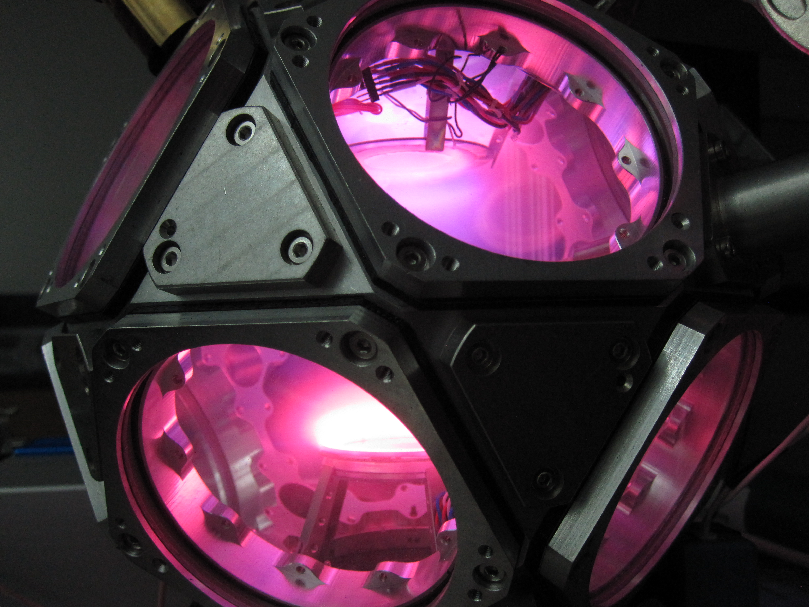

# $\mu$g-Lab

## Auburn University

$\mu$g-Lab (the Microgravity Laboratory) is a research group at Auburn University led by Uwe Konopka. This page is under construction.

## Website Pages
- [Our Group](group.md)
- [Experiments](experiments-overview.md)
    - [ALICE](experiments-alice.md)
    - [RaFyX](experiments-rafyx.md)
    - [DODECA](experiments-dodeca.md)
- [Can I link to box?](https://auburn.box.com/s/3duzx1iuh5b0ut0pcgkw1px3he3r6ngm.md)
- <a href="https://auburn.box.com/shared/static/3duzx1iuh5b0ut0pcgkw1px3he3r6ngm.md" target="_blank">Can I box link in new tab?</a>
